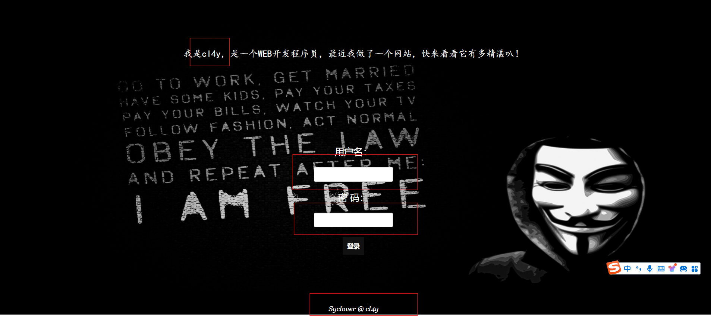
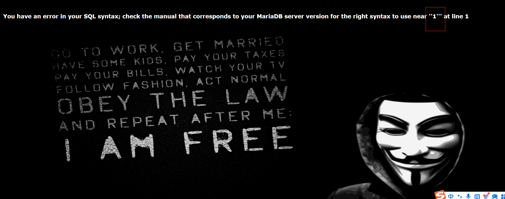

## BUUCTF WEB 1-easySQL解题过程【SQL注入】



## 解题思路

看题，盲猜用户名为cl4y，根据题目名称可能考察SQL注入，并以此开展。

## 解题过程


输入 1'



结果显示''1'''，有引号闭合，说明为字符型回显（输入的参数做为字符处理，一般有引号闭合）


进行字符型注入，使用万能密码 1' or '1'='1


注入成功。

## 解题原理【SQL注入】

SQL 注入就是指 Web 应用程序对用户输入的数据合法性没有**过滤或者是判断**，攻击者可以在Web应用程序中事先定义好的查询语句的结尾上添加额外的SQL语句，在管理员不知情的情况下实现非法操作，以此来实现欺骗数据库服务器执行非授权的任意查询，从而进一步得到相应的数据信息。

本题中web后端以sql查询语句判断用户名及密码是否正确。其代码类似如下：

```
select * from user  where id='$id' 
```

其中$id为前段输入的内容，如果web程序对用户输入的数据不进行过滤直接使用的话，使用万能密码（1 or '1'='1）带入到程序中如下：

```
select * from user  where id='1 or '1'='1' 
```

则SQL查询结果必为Ture。从而完成SQL注入。

## 其他

常用判断方式：id=1 order by 9999 --+ 正常回显是字符型，否则是数字型

常用万能密码：1 and 1=1(数字型) 或1' and '1'='1（字符型）或 1 or 1=1（数字型） 或 1 or '1'='1（字符型）

参考内容

###### 1、[BUUCTF web 系列详解 （详细版）持续更新中]https://blog.csdn.net/llki666/article/details/135241445
