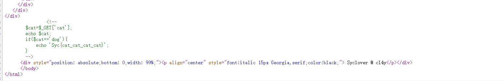
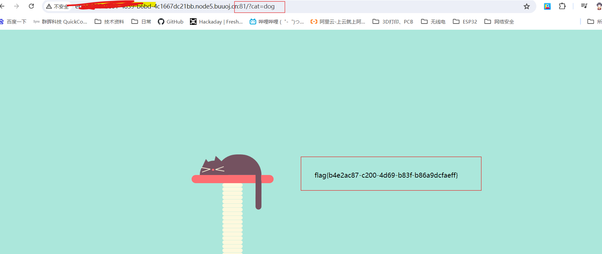

# BUUCTF WEB 2-Havefun解题过程【GET请求】

## **解题思路**

查看源码，发现一段代码。通过代码可知，GET请求一个参数cat，当该参数的值为‘dog’时会输出东西。

## 解题过程

直接在url后加上 ？cat =dog

解题成功。

## 解题原理【GET请求】

GET和POST是HTTP协议中的两种发送请求的方法。

通过在url后加上?id=1 进行GET请求。

例如：

###### 参考内容

[CTF_S10Sec的[什么是GET | 什么是POST]讲解(网页攻防Web)]https://www.jianshu.com/p/d492dc495062
