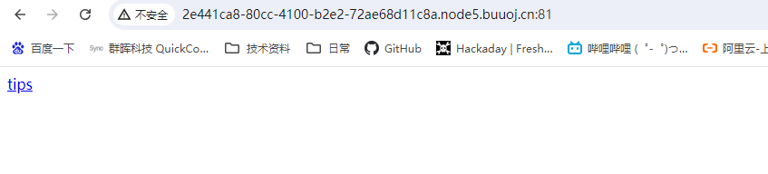
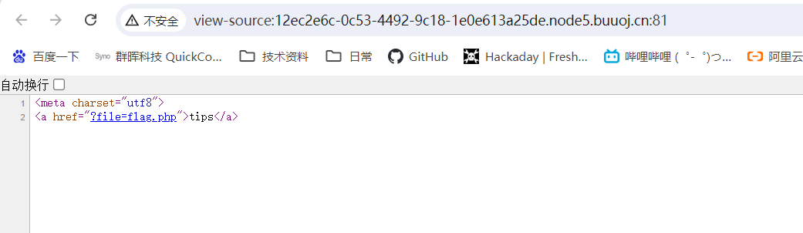
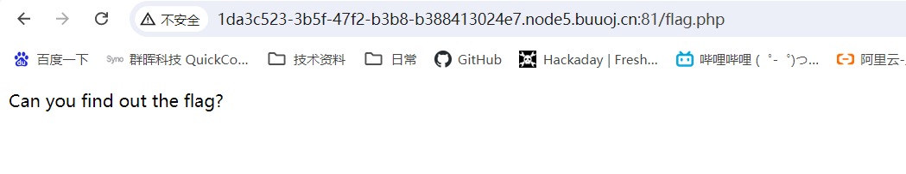
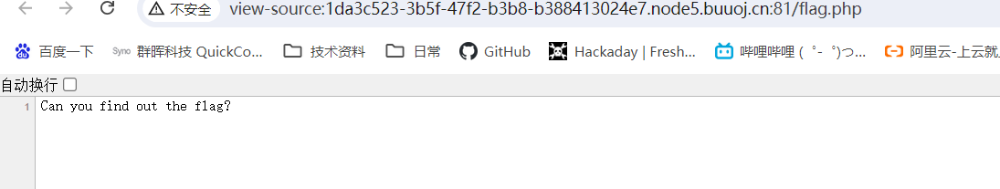
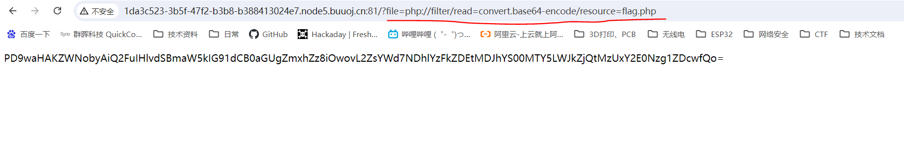

# BUUCTF WEB 4-Include解题过程【伪协议】

## 解题思路

查看此页源码

发现有个超链接，是将flag.php作为参数进行请求。打开flag.php及在浏览器中查看源码，均未发现flag。

****

但是通过文件名，应该能确定flag跟这个php文件有关系。解题中对[WEB服务器](../WEB笔记/Web服务器工作原理详解[From_CSDN_青城山小和尚].pdf)和[PHP解析过程](../WEB笔记/PHP解析过程.md)提升了一些理解，知道了浏览器中查看的网页源码只是远方web服务器发给浏览器的html等前端源码，这些源码是远方web服务器运行PHP解释器后，php文件生成的前端结果，并非flag.php文件本身的源码，所以我猜测flag是在flag.php文件的源码里，这也解释了为什么打开flag.php文件并未发现flag。

有了思路后，通过伪协议查看flag.php文件源码。发现flag。

## 解题原理【伪协议】

在 PHP 中，"伪协议"是一种特殊的语法，用于访问不同的资源或执行特定的操作。这些伪协议以 `php://` 开头，后面跟着特定的指示符或参数，以实现不同的功能。这些伪协议提供了一种方便的方式来处理各种输入输出操作，而不必依赖于实际的文件或网络资源。[详见](../漏洞解析/PHP基础知识——PHP伪协议 - smile_2233 - 博客园.pdf)

###### 参考内容

###### [PHP基础知识——PHP伪协议]https://www.cnblogs.com/smile2333/p/18128048
